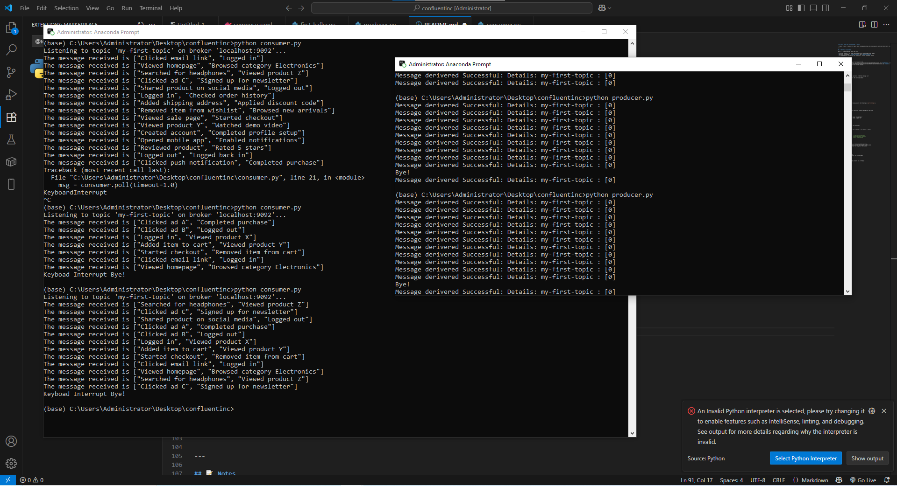

# 🟡 Simple Kafka Demo with ZooKeeper & Python

> A basic project to demonstrate Apache Kafka message publishing and consuming using Python and Docker with Confluent's Kafka and ZooKeeper images.

---

## 📦 What This Project Does

This is a lightweight demo setup that uses:

- 🐳 Docker Compose to run Kafka and ZooKeeper using Confluent’s Docker images
- 🐍 Python to implement a **Kafka producer** and a **Kafka consumer**
- ✅ A sample dataset to simulate user events (e.g. clicks, purchases, logins)

---

## 🔧 Tech Stack

| Tool         | Use                               |
|--------------|------------------------------------|
|  **ZooKeeper** | Coordination service Kafka needs to manage brokers |
|  **Kafka** | Distributed messaging system for event streaming |
| 🐍 **Python** | Used to produce and consume messages |

---

## 📁 Project Structure

```

.
├── docker-compose.yml
├── producer.py
├── consumer.py
├── messages\_data.py        # (optional) predefined message list
├── README.md
└── demo.png                # <-- Add your image here!

````

---

## ▶️ How to Run It

### 1. Start Kafka & ZooKeeper

Make sure Docker is running.

```bash
docker-compose up -d
````

This will start:

* `zookeeper` on port `2181`
* `kafka` on port `9092`

### 2. Produce Messages

```bash
python producer.py
```

This script sends multiple key-value pairs to the Kafka topic (`my-first-topic`).

### 3. Consume Messages

```bash
python consumer.py
```

This script listens to the topic and prints incoming messages in real-time.

---

## 🧪 Sample Output

```
Received message → Key: user1, Value: "Clicked ad A"
Received message → Key: user2, Value: "Logged out"
...
```

---

## 🖼️ Demo Screenshot

*Here’s what the project looks like in action:*



> Replace `demo.png` with your own screenshot of the console or setup!

---

## 📚 Useful Commands

```bash
docker ps                        # See running containers
docker-compose down             # Stop and remove containers
docker-compose up -d            # Start in background
```

---

## 📝 Notes

* Kafka requires ZooKeeper to run — that's why both are set up.
* Make sure the topic name in both producer and consumer scripts match.
* Messages are sent in UTF-8 format and logged to the console.

---

## ✅ What's Next?

You can expand this by:

* Using JSON payloads
* Connecting Kafka to a database
* Adding a web frontend to display real-time messages

---

## 📄 License

This is a basic educational/demo project. Use it freely!

---


